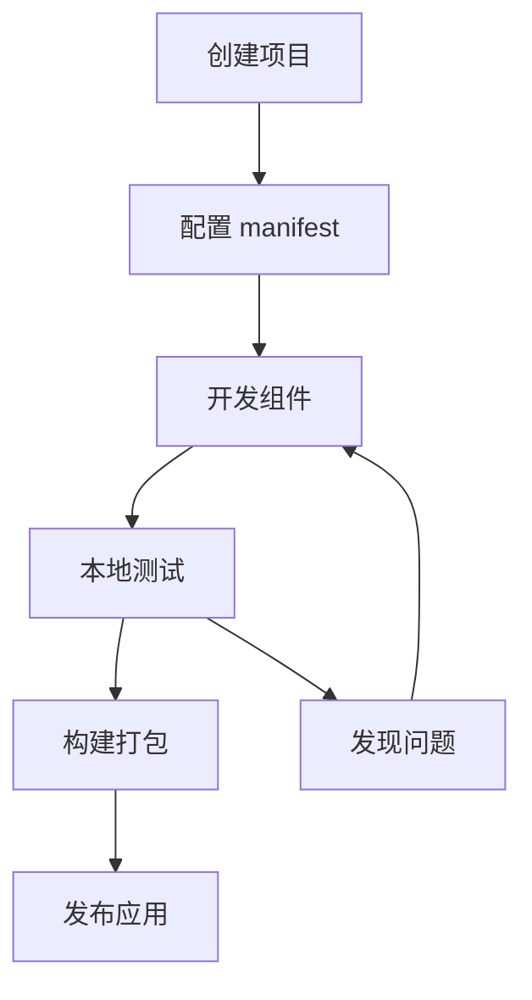

# Web 扩展基础概念

## 什么是 Web 扩展？

Web 扩展（Web Extensions）是一种可以增强或修改浏览器功能的软件程序。它们可以：

- 🔧 修改网页内容和行为
- 🎨 改变浏览器界面
- 🔗 与外部服务交互
- 📊 收集和处理数据
- 🛡️ 提供隐私和安全功能

## 扩展的发展历史

### Chrome 扩展演进
```
2009 ────────── 2020 ────────── 2023
  │               │               │
Manifest V1    Manifest V2    Manifest V3
(已废弃)        (逐渐淘汰)      (当前标准)
```

### 主要变化
| 版本 | 特点 | 状态 |
|------|------|------|
| V1 | 基础功能，安全性较差 | 已废弃 |
| V2 | 权限系统，后台页面 | 逐渐淘汰 |
| V3 | 服务工作线程，更强安全性 | 当前主流 |

## Manifest V3 核心特性

### 1. 服务工作线程 (Service Workers)
```javascript
// 替代传统的背景页面
// background.js
chrome.runtime.onInstalled.addListener(() => {
  console.log('扩展已安装');
});

// 监听消息
chrome.runtime.onMessage.addListener((message, sender, sendResponse) => {
  // 处理来自 content script 的消息
});
```

### 2. 声明式网络请求
```json
{
  "declarative_net_request": {
    "rule_resources": [{
      "id": "ruleset_1",
      "enabled": true,
      "path": "rules.json"
    }]
  }
}
```

### 3. 更严格的内容安全策略
```json
{
  "content_security_policy": {
    "extension_pages": "script-src 'self'; object-src 'self'"
  }
}
```

## 扩展架构组件

### 核心组件图
```
┌─────────────────────────────────────────┐
│              Chrome 浏览器               │
├─────────────────────────────────────────┤
│  ┌─────────────┐  ┌─────────────────────┐ │
│  │    Popup    │  │   Background/SW     │ │
│  │   (弹窗)     │  │   (后台服务)        │ │
│  └─────────────┘  └─────────────────────┘ │
│                                          │
│  ┌─────────────┐  ┌─────────────────────┐ │
│  │   Options   │  │   Content Script    │ │
│  │   (设置页)   │  │   (内容脚本)        │ │
│  └─────────────┘  └─────────────────────┘ │
└─────────────────────────────────────────┘
```

### 1. Background Script / Service Worker
**作用**: 扩展的"大脑"，处理后台逻辑

```javascript
// 典型用途
- 监听浏览器事件
- 处理网络请求
- 管理扩展状态
- 与其他组件通信
```

**生命周期**:
```
安装 → 启动 → 休眠 → 唤醒 → 卸载
```

### 2. Content Scripts
**作用**: 在网页中运行的脚本，可以读取和修改页面内容

```javascript
// content.js
// 可以访问页面 DOM
const title = document.title;

// 可以与背景脚本通信
chrome.runtime.sendMessage({
  action: 'pageInfo',
  title: title,
  url: window.location.href
});

// 可以注入 CSS
const style = document.createElement('style');
style.textContent = '.highlight { background: yellow; }';
document.head.appendChild(style);
```

**限制**:
- 不能访问扩展 API
- 不能访问其他标签页
- 与页面脚本隔离

### 3. Popup
**作用**: 点击扩展图标时显示的小窗口

```html
<!-- popup.html -->
<!DOCTYPE html>
<html>
<head>
  <style>
    body { width: 300px; padding: 20px; }
    .button { padding: 10px; margin: 5px; }
  </style>
</head>
<body>
  <h1>我的扩展</h1>
  <button id="action-btn">执行操作</button>
  <script src="popup.js"></script>
</body>
</html>
```

### 4. Options Page
**作用**: 扩展的设置界面

```html
<!-- options.html -->
<!DOCTYPE html>
<html>
<head>
  <title>扩展设置</title>
</head>
<body>
  <h1>设置</h1>
  <form>
    <label>
      <input type="checkbox" id="feature1"> 启用功能1
    </label>
    <br>
    <label>
      API Key: <input type="text" id="apiKey">
    </label>
    <br>
    <button type="button" id="save">保存设置</button>
  </form>
  <script src="options.js"></script>
</body>
</html>
```

## 消息传递机制

### 组件间通信
```javascript
// Content Script → Background
chrome.runtime.sendMessage({
  action: 'getData',
  params: { id: 123 }
}, (response) => {
  console.log('收到回复:', response);
});

// Background → Content Script
chrome.tabs.sendMessage(tabId, {
  action: 'updateUI',
  data: newData
});

// Popup → Background
chrome.runtime.getBackgroundPage((bg) => {
  bg.someFunction();
});
```

### 长连接通信
```javascript
// 建立长连接
const port = chrome.runtime.connect({ name: 'content-background' });

// 发送消息
port.postMessage({ action: 'start' });

// 监听消息
port.onMessage.addListener((msg) => {
  console.log('收到消息:', msg);
});
```

## 权限系统

### 常用权限
```json
{
  "permissions": [
    "activeTab",      // 当前标签页
    "storage",        // 存储数据
    "alarms",         // 定时器
    "notifications",  // 通知
    "contextMenus"    // 右键菜单
  ],
  "host_permissions": [
    "https://*.example.com/*",  // 特定域名
    "<all_urls>"                // 所有网站
  ]
}
```

### 权限最佳实践
1. **最小权限原则**: 只申请必需的权限
2. **动态权限**: 在需要时申请权限
3. **用户友好**: 解释为什么需要权限

## WXT 框架优势

### 传统开发 vs WXT 开发

| 方面 | 传统开发 | WXT 开发 |
|------|----------|----------|
| 配置 | 手动配置 manifest | 自动生成 |
| 热重载 | 需要手动刷新 | 自动热重载 |
| TypeScript | 需要配置 | 开箱即用 |
| 构建优化 | 手动配置 | 自动优化 |
| 开发体验 | 复杂 | 简化 |

### WXT 核心特性
```typescript
// 1. 类型安全
import { defineContentScript } from 'wxt/sandbox';

export default defineContentScript({
  matches: ['https://example.com/*'],
  main() {
    console.log('Hello from content script!');
  }
});

// 2. 自动化配置
// wxt.config.ts
export default defineConfig({
  manifest: {
    name: 'My Extension',
    permissions: ['activeTab']
  }
});

// 3. 组件化开发
// popup/App.tsx
import React from 'react';

export default function App() {
  return (
    <div className="p-4">
      <h1 className="text-xl font-bold">我的扩展</h1>
    </div>
  );
}
```

## 开发工作流

### 典型开发流程


### 调试工具
1. **Chrome DevTools**: 调试 popup 和 options
2. **Background Console**: 调试 service worker
3. **Content Script Debugger**: 调试内容脚本
4. **WXT Dev Server**: 热重载开发

## 常见使用场景

### 1. 内容增强
- 网页内容标注
- 翻译工具
- 广告拦截
- 样式美化

### 2. 生产力工具
- 密码管理
- 书签同步
- 截图工具
- 时间跟踪

### 3. 开发工具
- API 测试
- 性能监控
- 代码格式化
- 调试辅助

### 4. 社交和娱乐
- 社交媒体增强
- 视频下载
- 游戏辅助
- 内容聚合

## 安全考虑

### 常见安全风险
1. **XSS 攻击**: 不安全的内容注入
2. **权限滥用**: 过度申请权限
3. **数据泄露**: 不安全的数据存储
4. **恶意代码**: 第三方库风险

### 安全最佳实践
```javascript
// 1. 输入验证
function sanitizeInput(input) {
  return input.replace(/[<>\"'&]/g, (char) => {
    const entities = {
      '<': '&lt;',
      '>': '&gt;',
      '"': '&quot;',
      "'": '&#39;',
      '&': '&amp;'
    };
    return entities[char];
  });
}

// 2. 安全的消息传递
chrome.runtime.onMessage.addListener((message, sender, sendResponse) => {
  // 验证消息来源
  if (!sender.tab || !message.action) {
    return;
  }
  
  // 验证消息格式
  if (typeof message.data !== 'object') {
    return;
  }
  
  // 处理消息...
});

// 3. 安全的存储
chrome.storage.local.set({
  // 避免存储敏感信息
  preferences: encryptData(userPreferences)
});
```

## 实践练习

### 练习 1: 分析扩展架构
选择 3 个不同类型的 Chrome 扩展，分析它们的：
- 主要功能
- 使用的组件
- 权限需求
- 用户交互方式

### 练习 2: 绘制架构图
为以下扩展类型绘制架构图：
1. 网页翻译工具
2. 密码管理器
3. 广告拦截器

### 练习 3: 权限分析
列出以下功能需要的权限：
- 读取当前页面内容
- 发送网络请求
- 显示通知
- 访问浏览历史

## 总结

通过本章学习，你应该掌握：

✅ **Web 扩展的基本概念和工作原理**
- 理解扩展的作用和价值
- 掌握 Manifest V3 的新特性
- 了解扩展的发展趋势

✅ **扩展架构的核心组件**
- Background Script/Service Worker
- Content Scripts
- Popup 和 Options 页面
- 组件间的通信机制

✅ **WXT 框架的优势**
- 简化的开发流程
- 类型安全的开发体验
- 自动化的构建优化

✅ **安全和最佳实践**
- 权限系统的使用
- 安全开发的注意事项
- 性能优化的基本原则

下一章我们将进入实践环节，学习如何搭建完整的开发环境并创建第一个 WXT 扩展项目。
