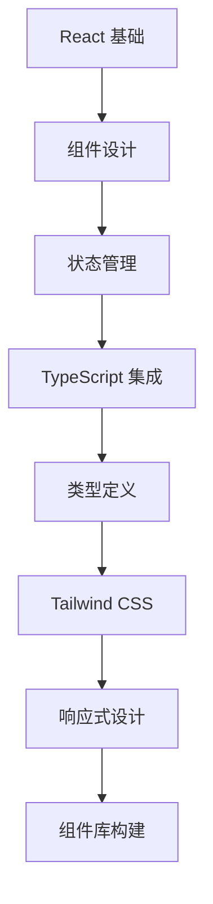

# 第二阶段：核心技术栈

## 概述

本阶段将深入学习现代 Web 扩展开发的核心技术栈：React、TypeScript 和 Tailwind CSS。你将学会如何在 WXT 框架中高效地使用这些技术来构建强大的用户界面和交互逻辑。

## 学习目标

- ⚛️ 掌握 React 在扩展开发中的最佳实践
- 📝 学会使用 TypeScript 确保代码质量和类型安全
- 🎨 运用 Tailwind CSS 快速构建现代化界面
- 🔄 理解组件化开发思想和状态管理
- 🛠️ 掌握现代前端开发工具的使用

## 章节内容

### [Day 3: React 基础应用](./React基础.md)
- React 核心概念回顾
- Hooks 在扩展开发中的应用
- 组件设计模式
- 状态管理最佳实践

### [Day 4: TypeScript 应用](./TypeScript应用.md)
- TypeScript 基础语法
- WXT 中的类型定义
- Chrome API 类型安全
- 错误处理和调试

### [Day 5: Tailwind CSS 样式](./TailwindCSS.md)
- 原子化 CSS 设计理念
- 响应式设计实现
- 组件样式库构建
- 主题定制和优化

## 技术栈优势

### React + TypeScript + Tailwind CSS
这个组合为现代扩展开发提供了：

1. **开发效率**: 组件化开发 + 类型安全 + 快速样式
2. **代码质量**: 严格的类型检查和最佳实践
3. **用户体验**: 现代化界面和流畅交互
4. **维护性**: 良好的代码结构和文档
5. **扩展性**: 易于添加新功能和修改

## 实践项目

### 扩展 UI 组件库
在本阶段，你将构建一个完整的扩展 UI 组件库，包括：
- 🎛️ 通用组件（Button, Input, Modal 等）
- 📱 扩展专用组件（TabList, PermissionManager 等）
- 🎨 主题系统和样式变量
- 📖 组件文档和使用示例

### 预期成果
完成本阶段学习后，你将能够：
- ✅ 熟练使用 React Hooks 开发复杂交互
- ✅ 编写类型安全的 TypeScript 代码
- ✅ 快速构建美观响应式界面
- ✅ 理解现代前端开发的最佳实践
- ✅ 为实际项目奠定坚实的技术基础

## 学习路径

## 下一步

完成核心技术学习后，你将进入第三阶段 - WXT 框架的深入应用，学习如何将这些技术整合到完整的扩展开发流程中。
