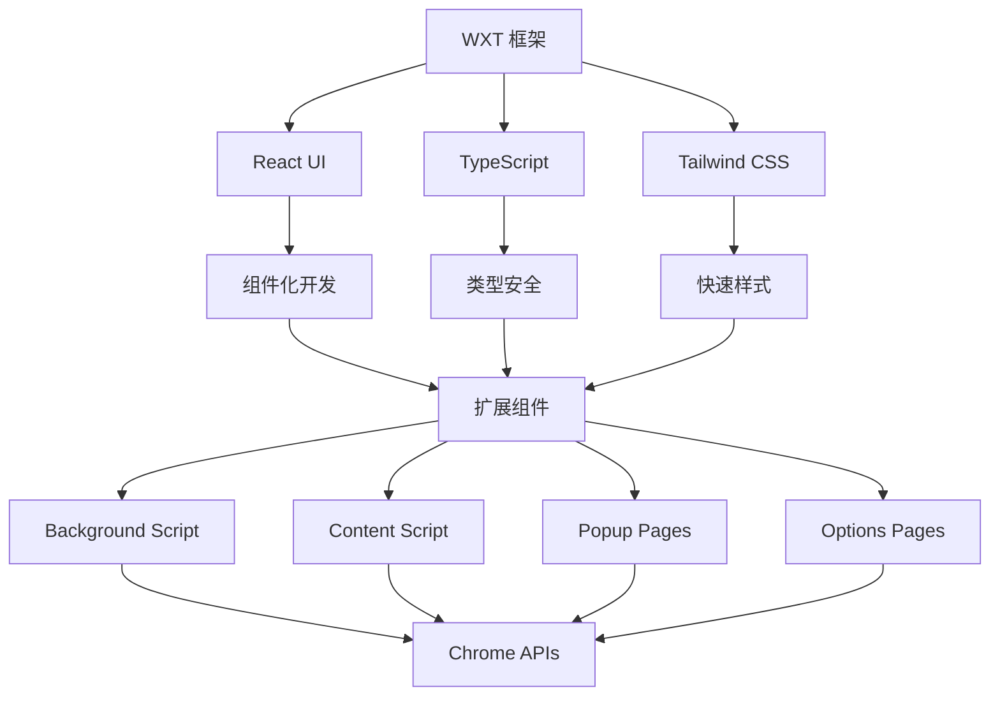
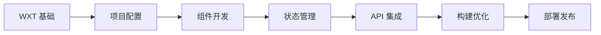

# 第三阶段：WXT 框架深入

## 概述

本阶段将深入学习 WXT 框架的核心功能和高级特性，学会如何将前面掌握的技术栈整合到完整的扩展开发流程中。你将掌握 WXT 的项目架构、配置系统、构建流程和部署策略。

## 学习目标

- 🚀 深入理解 WXT 框架的架构和设计理念
- 🔧 掌握 WXT 的配置系统和自定义能力
- 📦 学会扩展组件的开发和管理
- 🏗️ 理解构建流程和性能优化
- 🚀 掌握扩展的打包和发布流程

## 章节内容

### [Day 6: WXT 入门](./WXT入门.md)
- WXT 框架架构深入解析
- 项目结构和文件组织规范
- 配置系统详解
- 开发工作流优化

### [Day 7: 扩展组件开发](./扩展组件开发.md)
- Background Script 高级开发
- Content Script 最佳实践
- Popup 和 Options 页面开发
- 消息传递和状态管理

### [Day 8: 构建和部署](./构建部署.md)
- 构建流程和优化策略
- 多环境配置管理
- 打包和版本管理
- Chrome Web Store 发布

## WXT 框架优势回顾

### 对比传统开发方式

| 特性 | 传统方式 | WXT 方式 |
|------|----------|----------|
| 项目搭建 | 手动配置 manifest, webpack 等 | 一键创建，零配置启动 |
| 热重载 | 需要手动刷新扩展 | 自动热重载所有组件 |
| TypeScript | 手动配置类型定义 | 开箱即用的类型支持 |
| 样式处理 | 手动配置 CSS 处理器 | 内置 Tailwind CSS 支持 |
| 构建优化 | 手动配置 Tree-shaking 等 | 自动优化和代码分割 |
| 调试体验 | 基础的控制台调试 | 丰富的开发工具和错误提示 |

### 核心特性
```typescript
// 1. 声明式配置
export default defineConfig({
  manifest: {
    name: 'My Extension',
    permissions: ['activeTab']
  }
});

// 2. 类型安全的入口点
export default defineContentScript({
  matches: ['https://example.com/*'],
  main() {
    // 类型安全的开发体验
  }
});

// 3. 自动化构建优化
// WXT 自动处理：
// - 代码分割和懒加载
// - Tree-shaking 未使用代码
// - 资源压缩和优化
// - Source map 生成
```

## 技术架构整合

### 完整技术栈


### 开发工作流
```bash
# 1. 项目创建
npm create wxt@latest my-extension

# 2. 开发环境
npm run dev  # 启动开发服务器

# 3. 构建发布
npm run build  # 生产构建
npm run zip    # 打包发布
```

## 实践项目预览

在本阶段，你将开发一个功能完整的扩展项目，包含：

### 🎯 项目特性
- **多页面架构**: Popup、Options、Background
- **现代化 UI**: React + Tailwind CSS
- **类型安全**: 完整的 TypeScript 支持
- **状态管理**: 跨组件数据共享
- **权限管理**: 动态权限申请和管理
- **数据持久化**: Chrome Storage API 集成
- **国际化**: 多语言支持
- **性能优化**: 代码分割和懒加载

### 🏗️ 项目结构
```
my-extension/
├── entrypoints/
│   ├── background.ts      # 后台服务
│   ├── content.ts         # 内容脚本
│   ├── popup/             # 弹窗页面
│   └── options/           # 设置页面
├── components/            # React 组件
├── hooks/                 # 自定义 Hooks
├── utils/                 # 工具函数
├── types/                 # 类型定义
└── assets/               # 静态资源
```

## 预期成果

完成本阶段学习后，你将能够：

- ✅ **熟练使用 WXT 框架**
  - 理解框架核心原理
  - 掌握配置和定制方法
  - 能够解决开发中的常见问题

- ✅ **开发复杂扩展功能**
  - 实现多组件协作
  - 处理复杂的业务逻辑
  - 优化用户体验

- ✅ **掌握构建和部署流程**
  - 多环境配置管理
  - 性能优化策略
  - 发布和版本管理

- ✅ **具备项目架构能力**
  - 合理的代码组织
  - 可维护的项目结构
  - 扩展性设计考虑

## 学习路径



## 下一步

完成 WXT 框架学习后，你将进入最终的实战阶段，开发一个完整的扩展项目，将所有学到的知识应用到实际开发中。
