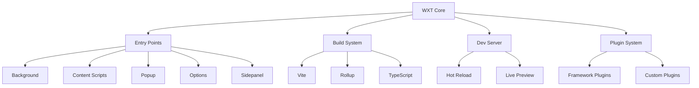

# WXT 入门

## WXT 框架深入解析

WXT (Web eXTension) 是下一代 Web 扩展开发框架，它基于 Vite 构建，为现代扩展开发提供了强大的工具链和开发体验。本章将深入探讨 WXT 的核心架构、配置系统和开发最佳实践。

## WXT 核心架构

### 1. 设计理念
```typescript
// WXT 的核心设计原则
const designPrinciples = {
  约定优于配置: '通过合理的默认配置减少开发者负担',
  类型安全: '全程 TypeScript 支持，编译时发现错误',
  开发体验: '热重载、错误提示、调试工具等',
  现代化: '基于 Vite，支持最新的前端技术栈',
  跨浏览器: '同时支持 Chrome、Firefox、Safari 等'
};
```

### 2. 架构组件图


### 3. 文件系统约定
```
my-extension/
├── entrypoints/           # 入口点目录 (约定)
│   ├── background.ts      # 后台脚本
│   ├── content/           # 内容脚本目录
│   │   ├── index.ts       # 主内容脚本
│   │   └── overlay.ts     # 覆盖层脚本
│   ├── popup/             # 弹窗页面
│   │   ├── index.html     # HTML 入口
│   │   ├── main.tsx       # React 入口
│   │   └── App.tsx        # 主组件
│   ├── options/           # 设置页面
│   ├── sidepanel/         # 侧边栏 (Chrome 114+)
│   ├── devtools/          # 开发者工具页面
│   └── newtab/            # 新标签页
├── components/            # 共享组件
├── utils/                 # 工具函数
├── assets/                # 静态资源
├── public/                # 公共资源
├── wxt.config.ts          # WXT 配置文件
└── package.json
```

## 入口点系统详解

### 1. 入口点发现机制
```typescript
// WXT 自动发现入口点的规则
const entryPointRules = {
  // 文件命名约定
  background: [
    'entrypoints/background.ts',
    'entrypoints/background.js',
    'entrypoints/background/index.ts'
  ],
  
  contentScript: [
    'entrypoints/content.ts',
    'entrypoints/content/index.ts',
    'entrypoints/content/*.ts'  // 支持多个内容脚本
  ],
  
  htmlPages: [
    'entrypoints/popup/index.html',
    'entrypoints/options/index.html',
    'entrypoints/*/index.html'   // 任意 HTML 页面
  ]
};
```

### 2. 入口点配置
```typescript
// entrypoints/background.ts
export default defineBackground({
  // 服务工作线程类型 (推荐)
  type: 'module',
  
  // 或者使用传统后台页面
  // persistent: false,
  
  main() {
    console.log('Background script started');
    
    // 扩展生命周期管理
    chrome.runtime.onInstalled.addListener((details) => {
      if (details.reason === 'install') {
        console.log('Extension installed for the first time');
      } else if (details.reason === 'update') {
        console.log('Extension updated');
      }
    });
    
    // 消息处理
    chrome.runtime.onMessage.addListener(async (message, sender, sendResponse) => {
      switch (message.type) {
        case 'GET_TAB_INFO':
          const tab = await chrome.tabs.get(sender.tab?.id || 0);
          return { success: true, data: tab };
        
        case 'SAVE_DATA':
          await chrome.storage.local.set({ [message.key]: message.value });
          return { success: true };
        
        default:
          return { success: false, error: 'Unknown message type' };
      }
    });
  }
});
```

### 3. 内容脚本配置
```typescript
// entrypoints/content.ts
export default defineContentScript({
  // 匹配模式
  matches: [
    'https://*.example.com/*',
    'https://specific-site.com/path/*'
  ],
  
  // 排除模式
  excludeMatches: [
    'https://example.com/admin/*'
  ],
  
  // 注入时机
  runAt: 'document_end',
  
  // 世界隔离
  world: 'ISOLATED', // 或 'MAIN'
  
  // CSS 文件
  css: ['content.css'],
  
  // 是否在所有框架中运行
  allFrames: false,
  
  main(ctx) {
    console.log('Content script loaded on:', window.location.href);
    
    // 页面交互
    function highlightText(selector: string) {
      const elements = document.querySelectorAll(selector);
      elements.forEach(el => {
        el.classList.add('wxt-highlight');
      });
    }
    
    // 监听来自 popup 的消息
    chrome.runtime.onMessage.addListener((message, sender, sendResponse) => {
      if (message.action === 'HIGHLIGHT') {
        highlightText(message.selector);
        sendResponse({ success: true });
      }
    });
    
    // 页面事件监听
    document.addEventListener('click', (event) => {
      const target = event.target as HTMLElement;
      if (target.matches('.special-button')) {
        chrome.runtime.sendMessage({
          type: 'BUTTON_CLICKED',
          data: { text: target.textContent }
        });
      }
    });
    
    // 清理函数
    return () => {
      console.log('Content script cleanup');
    };
  }
});
```

### 4. HTML 页面配置
```html
<!-- entrypoints/popup/index.html -->
<!DOCTYPE html>
<html lang="zh-CN">
<head>
  <meta charset="UTF-8">
  <meta name="viewport" content="width=device-width, initial-scale=1.0">
  <title>扩展弹窗</title>
</head>
<body>
  <div id="root"></div>
  <script type="module" src="./main.tsx"></script>
</body>
</html>
```

```typescript
// entrypoints/popup/main.tsx
import React from 'react';
import ReactDOM from 'react-dom/client';
import App from './App';
import '../styles/globals.css';

// 确保 DOM 已加载
const root = document.getElementById('root');
if (root) {
  ReactDOM.createRoot(root).render(<App />);
}
```

```typescript
// entrypoints/popup/App.tsx
import React, { useState, useEffect } from 'react';
import { Button } from '@/components/ui/Button';
import { useChromeStorage } from '@/hooks/useChromeStorage';

const App: React.FC = () => {
  const [currentTab, setCurrentTab] = useState<chrome.tabs.Tab | null>(null);
  const [settings, setSettings] = useChromeStorage('popup-settings', {
    showStats: true,
    autoClose: false
  });
  
  useEffect(() => {
    // 获取当前标签页
    chrome.tabs.query({ active: true, currentWindow: true }, (tabs) => {
      setCurrentTab(tabs[0]);
    });
  }, []);
  
  const handleHighlight = async () => {
    if (currentTab?.id) {
      try {
        await chrome.tabs.sendMessage(currentTab.id, {
          action: 'HIGHLIGHT',
          selector: 'p'
        });
        
        if (settings.autoClose) {
          window.close();
        }
      } catch (error) {
        console.error('Failed to highlight:', error);
      }
    }
  };
  
  return (
    <div className="w-80 p-4 bg-white">
      <header className="mb-4">
        <h1 className="text-lg font-semibold text-gray-900">
          页面工具
        </h1>
        {currentTab && (
          <p className="text-sm text-gray-500 truncate">
            {currentTab.title}
          </p>
        )}
      </header>
      
      <div className="space-y-3">
        <Button 
          onClick={handleHighlight}
          className="w-full"
          variant="primary"
        >
          高亮段落
        </Button>
        
        <div className="flex items-center justify-between">
          <span className="text-sm text-gray-700">显示统计</span>
          <input
            type="checkbox"
            checked={settings.showStats}
            onChange={(e) => setSettings({
              ...settings,
              showStats: e.target.checked
            })}
            className="h-4 w-4 text-blue-600"
          />
        </div>
        
        <div className="flex items-center justify-between">
          <span className="text-sm text-gray-700">操作后关闭</span>
          <input
            type="checkbox"
            checked={settings.autoClose}
            onChange={(e) => setSettings({
              ...settings,
              autoClose: e.target.checked
            })}
            className="h-4 w-4 text-blue-600"
          />
        </div>
      </div>
    </div>
  );
};

export default App;
```

## WXT 配置系统

### 1. 基础配置
```typescript
// wxt.config.ts
import { defineConfig } from 'wxt';

export default defineConfig({
  // 输出目录
  outDir: '.output',
  
  // 源码目录
  srcDir: '.',
  
  // 公共资源目录
  publicDir: 'public',
  
  // 扩展清单配置
  manifest: {
    name: '我的扩展',
    description: '一个功能强大的浏览器扩展',
    version: '1.0.0',
    
    // 权限配置
    permissions: [
      'activeTab',
      'storage',
      'tabs',
      'scripting'
    ],
    
    // 主机权限
    host_permissions: [
      'https://*.example.com/*'
    ],
    
    // 可选权限
    optional_permissions: [
      'bookmarks',
      'history'
    ],
    
    // 图标配置
    icons: {
      16: 'icon-16.png',
      48: 'icon-48.png',
      128: 'icon-128.png'
    },
    
    // 默认弹窗
    action: {
      default_popup: 'popup.html',
      default_title: '打开扩展'
    }
  }
});
```

### 2. 高级配置
```typescript
// wxt.config.ts
import { defineConfig } from 'wxt';
import react from '@vitejs/plugin-react';

export default defineConfig({
  // 开发服务器配置
  dev: {
    server: {
      port: 3000,
      hostname: 'localhost'
    }
  },
  
  // 构建配置
  build: {
    // 构建目标
    target: 'chrome88',
    
    // 是否生成 source map
    sourcemap: true,
    
    // 是否压缩代码
    minify: true,
    
    // 构建输出目录
    outDir: 'dist'
  },
  
  // Vite 配置
  vite: () => ({
    plugins: [react()],
    
    // 路径别名
    resolve: {
      alias: {
        '@': path.resolve(__dirname, './src'),
        '@/components': path.resolve(__dirname, './components'),
        '@/utils': path.resolve(__dirname, './utils')
      }
    },
    
    // 环境变量
    define: {
      __DEV__: JSON.stringify(process.env.NODE_ENV === 'development'),
      __VERSION__: JSON.stringify(process.env.npm_package_version)
    },
    
    // CSS 配置
    css: {
      postcss: {
        plugins: [
          require('tailwindcss'),
          require('autoprefixer')
        ]
      }
    }
  }),
  
  // 扩展清单动态配置
  manifest: ({ command, mode }) => ({
    name: mode === 'development' ? '[DEV] 我的扩展' : '我的扩展',
    version: process.env.npm_package_version,
    
    // 开发模式下添加额外权限
    ...(mode === 'development' && {
      permissions: ['tabs', 'storage', 'scripting', 'debugger']
    }),
    
    // 生产模式下的内容安全策略
    ...(mode === 'production' && {
      content_security_policy: {
        extension_pages: "script-src 'self'; object-src 'self'"
      }
    })
  })
});
```

### 3. 多环境配置
```typescript
// wxt.config.ts
import { defineConfig } from 'wxt';

const getConfig = (env: string) => {
  const baseConfig = {
    name: '我的扩展',
    description: '一个功能强大的浏览器扩展',
    permissions: ['activeTab', 'storage']
  };
  
  switch (env) {
    case 'development':
      return {
        ...baseConfig,
        name: '[DEV] ' + baseConfig.name,
        permissions: [...baseConfig.permissions, 'debugger']
      };
      
    case 'staging':
      return {
        ...baseConfig,
        name: '[STAGING] ' + baseConfig.name,
        permissions: [...baseConfig.permissions, 'tabs']
      };
      
    case 'production':
      return baseConfig;
      
    default:
      return baseConfig;
  }
};

export default defineConfig(({ command, mode }) => ({
  manifest: getConfig(mode),
  
  // 不同环境的构建配置
  build: {
    sourcemap: mode !== 'production',
    minify: mode === 'production'
  },
  
  // 开发服务器配置
  dev: {
    server: {
      port: mode === 'development' ? 3000 : 3001
    }
  }
}));
```

## 插件系统

### 1. 内置插件
```typescript
// WXT 内置插件示例
export default defineConfig({
  // React 插件
  vite: () => ({
    plugins: [
      // React 支持
      react(),
      
      // Vue 支持
      vue(),
      
      // Svelte 支持
      svelte()
    ]
  })
});
```

### 2. 自定义插件
```typescript
// plugins/manifest-validator.ts
import type { WxtPlugin } from 'wxt';

export function manifestValidator(): WxtPlugin {
  return {
    name: 'manifest-validator',
    
    // 在构建开始时验证清单
    buildStart() {
      console.log('Validating manifest...');
    },
    
    // 修改清单内容
    manifestGenerated(manifest) {
      // 验证必需字段
      if (!manifest.name) {
        throw new Error('Extension name is required');
      }
      
      // 添加默认图标
      if (!manifest.icons) {
        manifest.icons = {
          16: 'icon-16.png',
          48: 'icon-48.png',
          128: 'icon-128.png'
        };
      }
      
      return manifest;
    }
  };
}

// wxt.config.ts 中使用
export default defineConfig({
  plugins: [
    manifestValidator()
  ]
});
```

### 3. 自动化插件
```typescript
// plugins/auto-reload.ts
export function autoReload(): WxtPlugin {
  return {
    name: 'auto-reload',
    
    buildEnd() {
      if (process.env.NODE_ENV === 'development') {
        // 通知扩展重新加载
        this.emitFile({
          type: 'asset',
          fileName: 'reload-signal.txt',
          source: Date.now().toString()
        });
      }
    }
  };
}

// plugins/version-bump.ts
export function versionBump(): WxtPlugin {
  return {
    name: 'version-bump',
    
    manifestGenerated(manifest) {
      const packageJson = JSON.parse(
        fs.readFileSync('package.json', 'utf-8')
      );
      
      manifest.version = packageJson.version;
      return manifest;
    }
  };
}
```

## 开发工作流优化

### 1. 热重载机制
```typescript
// WXT 自动提供的热重载功能
const hotReloadFeatures = {
  background: '后台脚本自动重载',
  content: '内容脚本实时更新',
  popup: 'React 组件热更新',
  options: '设置页面实时预览',
  manifest: '清单文件变更自动应用'
};

// 手动触发重载
if (import.meta.hot) {
  import.meta.hot.accept(() => {
    console.log('Module hot updated');
  });
}
```

### 2. 调试工具集成
```typescript
// utils/debug.ts
export class DebugLogger {
  private static instance: DebugLogger;
  private isEnabled: boolean;
  
  constructor() {
    this.isEnabled = process.env.NODE_ENV === 'development';
  }
  
  static getInstance(): DebugLogger {
    if (!DebugLogger.instance) {
      DebugLogger.instance = new DebugLogger();
    }
    return DebugLogger.instance;
  }
  
  log(message: string, data?: any) {
    if (this.isEnabled) {
      console.log(`[WXT Debug] ${message}`, data);
    }
  }
  
  error(message: string, error?: any) {
    if (this.isEnabled) {
      console.error(`[WXT Error] ${message}`, error);
    }
  }
  
  performance(label: string, fn: () => any) {
    if (this.isEnabled) {
      console.time(label);
      const result = fn();
      console.timeEnd(label);
      return result;
    }
    return fn();
  }
}

export const debug = DebugLogger.getInstance();
```

### 3. 构建优化
```typescript
// wxt.config.ts
export default defineConfig({
  build: {
    // 代码分割
    rollupOptions: {
      output: {
        manualChunks: {
          'vendor': ['react', 'react-dom'],
          'utils': ['lodash', 'date-fns']
        }
      }
    },
    
    // 资源优化
    assetsInlineLimit: 4096,
    
    // 压缩配置
    minify: 'terser',
    terserOptions: {
      compress: {
        drop_console: true,
        drop_debugger: true
      }
    }
  },
  
  // 预构建依赖
  optimizeDeps: {
    include: ['react', 'react-dom'],
    exclude: ['@wxt-dev/module']
  }
});
```

## 类型定义系统

### 1. WXT 内置类型
```typescript
// types/wxt.d.ts
declare module 'wxt/sandbox' {
  export function defineBackground(config: BackgroundConfig): void;
  export function defineContentScript(config: ContentScriptConfig): void;
  
  interface BackgroundConfig {
    type?: 'module' | 'classic';
    persistent?: boolean;
    main: () => void | Promise<void>;
  }
  
  interface ContentScriptConfig {
    matches: string[];
    excludeMatches?: string[];
    runAt?: 'document_start' | 'document_end' | 'document_idle';
    world?: 'ISOLATED' | 'MAIN';
    css?: string[];
    allFrames?: boolean;
    main: (ctx: ContentScriptContext) => void | (() => void);
  }
  
  interface ContentScriptContext {
    signal: AbortSignal;
  }
}
```

### 2. 扩展类型定义
```typescript
// types/extension.d.ts
declare global {
  namespace WXT {
    interface ManifestV3 {
      name: string;
      version: string;
      description?: string;
      permissions?: Permission[];
      host_permissions?: string[];
      optional_permissions?: Permission[];
      action?: {
        default_popup?: string;
        default_title?: string;
        default_icon?: Record<string, string>;
      };
      icons?: Record<string, string>;
      background?: {
        service_worker: string;
        type?: 'module';
      };
      content_scripts?: ContentScript[];
    }
    
    type Permission = 
      | 'activeTab'
      | 'storage'
      | 'tabs'
      | 'scripting'
      | 'bookmarks'
      | 'history'
      | 'notifications';
      
    interface ContentScript {
      matches: string[];
      js?: string[];
      css?: string[];
      run_at?: 'document_start' | 'document_end' | 'document_idle';
      all_frames?: boolean;
    }
  }
}
```

### 3. 项目特定类型
```typescript
// types/app.d.ts
export interface ExtensionConfig {
  theme: 'light' | 'dark' | 'auto';
  language: 'zh-CN' | 'en-US';
  features: {
    autoSave: boolean;
    notifications: boolean;
    analytics: boolean;
  };
}

export interface TabData {
  id: number;
  title: string;
  url: string;
  favIconUrl?: string;
  active: boolean;
  pinned: boolean;
  groupId?: number;
  lastAccessed?: number;
}

export interface MessagePayload<T = any> {
  type: string;
  data?: T;
  timestamp: number;
  source: 'background' | 'content' | 'popup' | 'options';
}
```

## 实践练习

### 练习 1: 自定义入口点
创建一个新的入口点类型：
- [ ] 实现 sidepanel 入口点
- [ ] 添加 devtools 页面
- [ ] 配置多个内容脚本
- [ ] 实现页面间通信

### 练习 2: 插件开发
开发自定义 WXT 插件：
- [ ] 清单文件验证插件
- [ ] 自动版本管理插件
- [ ] 国际化支持插件
- [ ] 性能监控插件

### 练习 3: 配置优化
优化项目配置：
- [ ] 多环境配置管理
- [ ] 构建性能优化
- [ ] 开发体验改进
- [ ] 类型定义完善

## 常见问题解决

### Q1: 入口点没有被识别
```typescript
// 确保文件路径正确
entrypoints/
├── background.ts     ✅ 正确
├── content.ts        ✅ 正确
├── popup/
│   └── index.html    ✅ 正确
└── options.ts        ❌ 错误，应该是 options/index.html
```

### Q2: 热重载不工作
```bash
# 重启开发服务器
npm run dev

# 检查端口冲突
lsof -i :3000

# 清除缓存
rm -rf .wxt node_modules/.vite
npm install
```

### Q3: 类型错误
```typescript
// 安装类型定义
npm install -D @types/chrome @types/node

// 配置 tsconfig.json
{
  "compilerOptions": {
    "types": ["chrome", "node", "wxt/client"]
  }
}
```

## 总结

通过本章学习，你应该掌握：

✅ **WXT 框架核心架构**
- 入口点系统和文件约定
- 配置系统的使用
- 插件系统的扩展

✅ **开发工作流优化**
- 热重载和调试工具
- 构建优化策略
- 多环境配置管理

✅ **类型系统应用**
- WXT 内置类型使用
- 自定义类型定义
- 类型安全开发

✅ **实际开发能力**
- 复杂扩展架构设计
- 性能优化实施
- 问题排查和解决

下一章我们将学习扩展组件的深入开发，包括各种入口点的高级用法和最佳实践。
