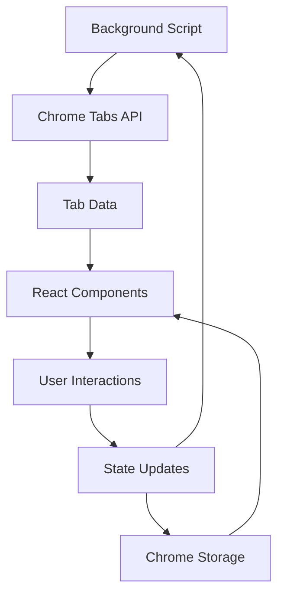

# 第四阶段：实战项目

## 概述

本阶段是整个学习过程的实战环节，你将运用前面学到的所有知识开发一个功能完整的 Chrome 扩展。通过实际项目开发，巩固技能并获得真实的开发经验。

## 学习目标

- 🎯 综合运用 WXT + React + TypeScript + Tailwind CSS 技术栈
- 🏗️ 掌握完整的扩展开发流程
- 🛠️ 解决实际开发中遇到的各种问题
- 🚀 完成一个可发布的扩展产品
- 📈 建立扩展开发的信心和经验

## 项目选择

### 🎨 项目A：智能标签页管理器 (TabMaster)
**难度**: ⭐⭐⭐☆☆ | **推荐指数**: ⭐⭐⭐⭐⭐

一个功能强大的标签页管理工具，帮助用户更好地组织和管理浏览器标签页。

**核心功能**:
- 📋 标签页分组和分类
- 🔍 智能搜索和过滤
- 💾 会话保存和恢复
- 🔄 重复标签页检测和合并
- 📊 标签页使用统计
- 🎨 自定义主题和布局

**技术亮点**:
- React Hooks 状态管理
- Chrome Tabs API 深度应用
- 本地数据存储和同步
- 拖拽排序功能
- 虚拟滚动优化

---

### 🔐 项目B：密码安全助手 (SecureVault)
**难度**: ⭐⭐⭐⭐☆ | **推荐指数**: ⭐⭐⭐⭐☆

一个注重安全的密码管理扩展，提供密码生成、存储和自动填充功能。

**核心功能**:
- 🔐 强密码生成器
- 💾 加密密码存储
- 🔄 自动表单填充
- 🛡️ 密码安全检测
- 📱 跨设备同步
- 🔍 网站安全评估

**技术亮点**:
- 端到端加密实现
- Content Script 深度交互
- 复杂表单识别和填充
- 生物识别认证集成
- 安全的数据传输

---

### 🌐 项目C：网页翻译助手 (TranslateMaster)
**难度**: ⭐⭐⭐☆☆ | **推荐指数**: ⭐⭐⭐⭐☆

一个智能的网页翻译工具，支持划词翻译、全页翻译和多语言学习。

**核心功能**:
- ✨ 划词即时翻译
- 📄 全页面翻译
- 🗂️ 翻译历史记录
- 📚 生词本和学习模式
- 🎙️ 语音朗读功能
- 🌍 多翻译引擎支持

**技术亮点**:
- 文本选择和提取
- API 集成和错误处理
- 音频播放和控制
- 复杂 UI 交互
- 离线翻译功能

## 推荐项目：智能标签页管理器

考虑到学习效果和实用性，我们选择 **TabMaster（智能标签页管理器）** 作为主要实战项目。

### 为什么选择这个项目？

1. **技术覆盖全面**: 涵盖所有核心技术点
2. **实用性强**: 解决真实的用户痛点
3. **复杂度适中**: 既有挑战性又不会过于困难
4. **扩展性好**: 易于添加新功能和优化
5. **学习价值高**: 能够学到标签页管理的最佳实践

## 项目规划

### 🗓️ 开发计划 (2天)

#### Day 9: 核心功能开发
**上午 (3小时)**: 项目搭建和基础功能
- 项目初始化和环境配置
- 基础组件开发
- 标签页数据获取和显示

**下午 (3小时)**: 高级功能实现
- 搜索和过滤功能
- 分组和分类机制
- 数据持久化

#### Day 10: 完善和发布
**上午 (2小时)**: 功能完善和优化
- UI/UX 优化
- 性能优化
- 错误处理

**下午 (3小时)**: 测试和发布
- 功能测试和调试
- 打包和优化
- 发布准备

### 📋 功能规划

#### 第一阶段：基础功能 (Day 9 上午)
- [x] 项目搭建和配置
- [x] 标签页列表显示
- [x] 基本的关闭和切换功能
- [x] 简单的搜索功能

#### 第二阶段：高级功能 (Day 9 下午)  
- [x] 标签页分组功能
- [x] 会话保存和恢复
- [x] 重复标签页检测
- [x] 标签页统计信息

#### 第三阶段：优化完善 (Day 10)
- [x] UI/UX 优化
- [x] 性能优化
- [x] 错误处理和边界情况
- [x] 用户设置和个性化

## 技术架构

### 📁 项目结构
```
tab-master/
├── entrypoints/
│   ├── background.ts           # 后台服务
│   ├── content.ts             # 内容脚本 (可选)
│   ├── popup/                 # 主界面
│   │   ├── index.html
│   │   ├── App.tsx
│   │   └── main.tsx
│   └── options/               # 设置页面
│       ├── index.html
│       ├── App.tsx
│       └── main.tsx
├── components/                # 通用组件
│   ├── TabCard.tsx           # 标签页卡片
│   ├── TabGroup.tsx          # 标签页分组
│   ├── SearchBar.tsx         # 搜索栏
│   ├── FilterPanel.tsx       # 过滤面板
│   └── StatsSummary.tsx      # 统计摘要
├── hooks/                     # 自定义钩子
│   ├── useTabs.ts            # 标签页管理
│   ├── useStorage.ts         # 存储管理
│   ├── useSearch.ts          # 搜索功能
│   └── useGroups.ts          # 分组管理
├── utils/                     # 工具函数
│   ├── tabUtils.ts           # 标签页工具
│   ├── storageUtils.ts       # 存储工具
│   └── searchUtils.ts        # 搜索工具
├── types/                     # 类型定义
│   ├── Tab.ts                # 标签页类型
│   ├── Group.ts              # 分组类型
│   └── Storage.ts            # 存储类型
├── assets/                    # 静态资源
│   ├── icons/                # 图标
│   └── images/               # 图片
└── styles/                    # 样式文件
    └── globals.css           # 全局样式
```

### 🔄 数据流设计


### 💾 数据模型
```typescript
// 标签页扩展信息
interface ExtendedTab extends chrome.tabs.Tab {
  groupId?: string;
  lastAccessed?: number;
  accessCount?: number;
  isBookmarked?: boolean;
  isDuplicate?: boolean;
  customTitle?: string;
  tags?: string[];
}

// 标签页分组
interface TabGroup {
  id: string;
  name: string;
  color: string;
  icon?: string;
  tabIds: number[];
  createdAt: number;
  isCollapsed?: boolean;
}

// 会话信息
interface Session {
  id: string;
  name: string;
  tabs: SavedTab[];
  createdAt: number;
  updatedAt: number;
}

// 保存的标签页
interface SavedTab {
  url: string;
  title: string;
  favIconUrl?: string;
  groupId?: string;
}

// 用户设置
interface UserSettings {
  theme: 'light' | 'dark' | 'auto';
  defaultView: 'list' | 'grid' | 'compact';
  groupBy: 'none' | 'domain' | 'custom';
  autoGroup: boolean;
  duplicateDetection: boolean;
  sessionAutoSave: boolean;
  maxSessions: number;
  showStats: boolean;
}
```

## 开发指南

### 🛠️ 开发环境设置
```bash
# 1. 创建项目
npm create wxt@latest tab-master
cd tab-master

# 2. 选择模板
# 选择: react-ts

# 3. 安装依赖
npm install

# 4. 启动开发服务器
npm run dev

# 5. 在 Chrome 中加载扩展
# 打开 chrome://extensions/
# 开启开发者模式
# 点击"加载已解压的扩展程序"
# 选择项目的 .output 目录
```

### 📝 开发检查清单

#### 项目搭建阶段
- [ ] WXT 项目初始化完成
- [ ] TypeScript 配置优化
- [ ] Tailwind CSS 配置和自定义主题
- [ ] 基础组件结构搭建
- [ ] Chrome 扩展权限配置

#### 功能开发阶段
- [ ] 标签页数据获取和显示
- [ ] 搜索和过滤功能
- [ ] 分组管理系统
- [ ] 会话保存和恢复
- [ ] 重复标签页检测
- [ ] 用户设置管理

#### 优化完善阶段
- [ ] UI/UX 细节优化
- [ ] 性能优化和内存管理
- [ ] 错误处理和用户反馈
- [ ] 国际化支持 (可选)
- [ ] 单元测试 (可选)

#### 发布准备阶段
- [ ] 功能完整性测试
- [ ] 浏览器兼容性测试
- [ ] 性能和内存测试
- [ ] 用户体验测试
- [ ] 打包和发布准备

## 成功标准

完成实战项目后，你应该能够：

### 🎯 技术能力
- ✅ 熟练使用 WXT 框架开发扩展
- ✅ 掌握 React + TypeScript 的最佳实践
- ✅ 运用 Tailwind CSS 构建现代化界面
- ✅ 处理复杂的状态管理和数据流
- ✅ 集成 Chrome APIs 实现丰富功能

### 🏗️ 项目能力
- ✅ 独立完成项目的架构设计
- ✅ 编写可维护和可扩展的代码
- ✅ 处理实际开发中的各种问题
- ✅ 优化应用性能和用户体验
- ✅ 完成项目的测试和发布

### 💼 职业技能
- ✅ 具备完整的扩展开发能力
- ✅ 理解现代前端开发的工作流程
- ✅ 掌握项目管理和版本控制
- ✅ 能够独立解决技术问题
- ✅ 具备持续学习和技术更新的能力

## 下一步计划

完成实战项目后，你可以考虑：

1. **🚀 发布扩展**
   - 提交到 Chrome Web Store
   - 收集用户反馈
   - 迭代优化功能

2. **📚 深入学习**
   - 学习更多 Chrome APIs
   - 探索 Firefox 扩展开发
   - 学习移动端扩展开发

3. **🔧 技术扩展**
   - 学习测试驱动开发
   - 掌握 CI/CD 流程
   - 探索 Micro-frontend 架构

4. **💼 职业发展**
   - 参与开源项目
   - 分享技术经验
   - 考虑相关职业机会

让我们开始这个激动人心的实战项目吧！🚀
