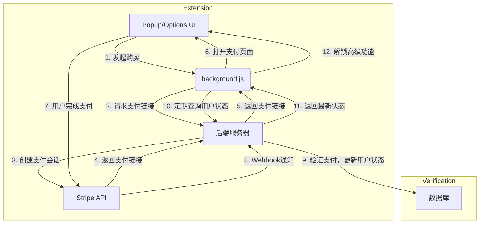

# Chrome 插件付费功能接入指南

## 🎯 盈利模式概览

为 Chrome 扩展添加付费功能是实现商业价值的关键一步。本指南将详细介绍不同的盈利模式、技术实现方案和最佳实践。

### 💰 主要盈利模式

| 模式 | 描述 | 优点 | 缺点 | 适用场景 |
| :--- | :--- | :--- | :--- | :--- |
| **一次性付费** | 用户支付一次性费用购买扩展的永久使用权。 | 简单直接，用户易于理解。 | 收入来源不稳定，难以持续。 | 功能固定的工具类扩展。 |
| **订阅模式** | 用户按月或按年支付费用，持续获得服务和更新。 | 持续稳定的现金流，利于长期发展。 | 实现复杂，需要持续提供价值。 | 服务型、内容更新型扩展。 |
| **免费增值 (Freemium)** | 基础功能免费，高级功能需要付费解锁。 | 用户基数大，易于推广。 | 需要平衡免费和付费功能。 | 大多数扩展的首选模式。 |
| **应用内购买** | 用户可以购买消耗品（如积分）或解锁特定功能。 | 灵活，可满足不同用户需求。 | 容易引起用户反感，设计复杂。 | 游戏类、内容消费类扩展。 |

---

## 1. 官方支付方案：Chrome Web Store Payments

Chrome Web Store 提供了内置的支付系统，但功能非常有限，并且 **Google 已宣布自 2020 年起不再支持新的付费扩展**。现有付费扩展仍可继续使用，但新开发者无法使用此方案。

### 📉 官方方案的局限性
- **仅支持一次性付费**：不支持订阅、免费增值等灵活模式。
- **高额抽成**：Google 会抽取 5% 的交易费用。
- **功能限制**：无法管理许可证、提供优惠码、处理退款等。
- **已停止支持**：新扩展无法使用。

> **结论**：由于官方支付方案已停止更新且功能受限，**强烈建议使用第三方支付解决方案**。

---

## 2. 第三方支付解决方案

使用第三方支付平台是目前主流且最灵活的方式。这通常需要一个后端服务器来处理支付逻辑和用户授权。

### 🏆 主流支付平台对比

| 平台 | 优点 | 缺点 | 抽成 | 适用场景 |
| :--- | :--- | :--- | :--- | :--- |
| **Stripe** | 功能强大，API 完善，文档清晰，支持全球支付。 | 需要自行处理税务和合规问题。 | 2.9% + $0.30 (标准) | 全球业务，需要高度定制化。 |
| **Paddle** | 作为 Merchant of Record (MoR)，自动处理税务和合规。 | API 相对简单，定制性不如 Stripe。 | 5% + $0.50 | 希望简化税务和财务流程的开发者。 |
| **Lemon Squeezy** | 同样是 MoR，UI/UX 优秀，专注于软件和数字产品。 | 相对较新，生态系统不如 Stripe。 | 5% + $0.50 | 独立开发者和小型团队。 |

> **推荐方案**：对于大多数开发者来说，**Stripe** 是功能最强大、最灵活的选择。如果你希望完全外包税务和合规问题，**Paddle** 或 **Lemon Squeezy** 是绝佳的替代方案。

---

## 3. 技术实现架构

无论选择哪个支付平台，技术实现的核心架构是相似的：

**扩展 (Frontend) ↔️ 后端服务器 (Backend) ↔️ 支付平台 (Payment Provider)**

### 🏗️ 架构图



### ✅ 核心流程解析
1. **用户认证**：用户通过 Google、邮箱或其他方式登录，后端为其创建账户。
2. **发起支付**：用户在扩展中点击“升级”按钮。
3. **创建支付会话**：扩展将用户信息发送到后端，后端调用支付平台 API 创建一个支付会话 (Checkout Session)。
4. **重定向支付**：后端将支付页面的 URL 返回给扩展，扩展打开新标签页让用户完成支付。
5. **支付结果通知**：支付平台通过 Webhook 将支付成功或失败的结果通知给后端。
6. **更新用户状态**：后端验证 Webhook 通知的合法性，然后更新数据库中的用户状态（例如，`is_premium: true`）。
7. **验证许可证**：扩展定期向后端查询用户状态，根据返回结果解锁或锁定高级功能。

---

## 4. 实战：使用 Stripe 实现订阅模式

本节将以 **Stripe** 为例，展示如何为 Chrome 扩展添加订阅功能。

### 🛠️ 准备工作

1. **注册 Stripe 账户**：获取 API 密钥 (Publishable Key 和 Secret Key)。
2. **创建产品和价格**：在 Stripe Dashboard 中创建一个订阅产品（例如，“Pro Plan”）并为其设置价格。
3. **设置后端服务器**：使用 Node.js、Express 和相关的库。
   ```bash
   npm init -y
   npm install express stripe cors dotenv firebase-admin
   ```
4. **用户认证系统**：这里我们使用 Firebase Authentication 作为示例。

### 后端实现 (Node.js + Express)

#### 📂 项目结构
```
/backend
├── .env
├── package.json
└── server.js
```

#### 🔑 `.env` 文件
```
STRIPE_SECRET_KEY=sk_test_...
STRIPE_WEBHOOK_SECRET=whsec_...
FIREBASE_SERVICE_ACCOUNT_KEY=... (JSON 格式)
```

#### 📝 `server.js`
```javascript
require('dotenv').config();
const express = require('express');
const cors = require('cors');
const stripe = require('stripe')(process.env.STRIPE_SECRET_KEY);
const admin = require('firebase-admin');

// 初始化 Firebase Admin
const serviceAccount = JSON.parse(process.env.FIREBASE_SERVICE_ACCOUNT_KEY);
admin.initializeApp({
  credential: admin.credential.cert(serviceAccount)
});
const db = admin.firestore();

const app = express();

// 中间件：验证 Firebase ID Token
const authenticate = async (req, res, next) => {
  const token = req.headers.authorization?.split('Bearer ')[1];
  if (!token) {
    return res.status(401).send('Unauthorized');
  }
  try {
    const decodedToken = await admin.auth().verifyIdToken(token);
    req.user = decodedToken;
    next();
  } catch (error) {
    res.status(401).send('Unauthorized');
  }
};

// 允许扩展前端的 CORS 请求
app.use(cors({ origin: `chrome-extension://${process.env.EXTENSION_ID}` }));

// 1. 创建 Stripe Checkout 会话
app.post('/create-checkout-session', authenticate, async (req, res) => {
  const { priceId } = req.body;
  const userId = req.user.uid;

  try {
    const session = await stripe.checkout.sessions.create({
      payment_method_types: ['card'],
      line_items: [{
        price: priceId,
        quantity: 1,
      }],
      mode: 'subscription',
      success_url: `chrome-extension://${process.env.EXTENSION_ID}/success.html`,
      cancel_url: `chrome-extension://${process.env.EXTENSION_ID}/cancel.html`,
      // 将 Firebase 用户 ID 传递给 Stripe
      client_reference_id: userId,
    });
    res.json({ id: session.id, url: session.url });
  } catch (error) {
    res.status(500).json({ error: error.message });
  }
});

// 2. Stripe Webhook 处理器
app.post('/webhook', express.raw({ type: 'application/json' }), async (req, res) => {
  const sig = req.headers['stripe-signature'];
  let event;

  try {
    event = stripe.webhooks.constructEvent(req.body, sig, process.env.STRIPE_WEBHOOK_SECRET);
  } catch (err) {
    return res.status(400).send(`Webhook Error: ${err.message}`);
  }

  // 处理 checkout.session.completed 事件
  if (event.type === 'checkout.session.completed') {
    const session = event.data.object;
    const userId = session.client_reference_id;
    const subscriptionId = session.subscription;

    // 更新 Firestore 中的用户数据
    await db.collection('users').doc(userId).set({
      stripeSubscriptionId: subscriptionId,
      status: 'active', // 或 'trialing'
    }, { merge: true });
  }
  
  // 处理其他订阅事件 (更新、取消等)
  if (event.type === 'customer.subscription.updated' || event.type === 'customer.subscription.deleted') {
    const subscription = event.data.object;
    const userId = (await db.collection('users').where('stripeSubscriptionId', '==', subscription.id).get()).docs[0]?.id;
    
    if (userId) {
      await db.collection('users').doc(userId).update({
        status: subscription.status,
      });
    }
  }

  res.status(200).send();
});

// 3. 获取用户许可证状态
app.get('/license-status', authenticate, async (req, res) => {
  const userId = req.user.uid;
  const userDoc = await db.collection('users').doc(userId).get();

  if (!userDoc.exists) {
    return res.json({ status: 'free' });
  }

  const userData = userDoc.data();
  res.json({ status: userData.status || 'free' });
});

const PORT = process.env.PORT || 3000;
app.listen(PORT, () => console.log(`Server running on port ${PORT}`));
```

### 扩展前端实现 (WXT + React)

#### 🔑 用户认证
在扩展中，使用 Firebase Authentication SDK 让用户登录。
```typescript
// utils/auth.ts
import { getAuth, GoogleAuthProvider, signInWithPopup } from 'firebase/auth';

const auth = getAuth();
const provider = new GoogleAuthProvider();

export const signInWithGoogle = async () => {
  try {
    const result = await signInWithPopup(auth, provider);
    const user = result.user;
    const idToken = await user.getIdToken();
    // 将 idToken 存储起来用于后续的 API 请求
    await storage.set('idToken', idToken);
    return user;
  } catch (error) {
    console.error("Authentication error:", error);
    return null;
  }
};
```

#### 🛒 发起购买
```typescript
// components/UpgradeButton.tsx
import React from 'react';

const UpgradeButton = () => {
  const handleUpgrade = async () => {
    const idToken = await storage.get('idToken');
    const response = await fetch('https://your-backend.com/create-checkout-session', {
      method: 'POST',
      headers: {
        'Content-Type': 'application/json',
        'Authorization': `Bearer ${idToken}`,
      },
      body: JSON.stringify({ priceId: 'price_...' }), // 你的 Stripe Price ID
    });
    const session = await response.json();
    // 打开 Stripe Checkout 页面
    window.open(session.url, '_blank');
  };

  return <button onClick={handleUpgrade}>Upgrade to Pro</button>;
};
```

#### 🛡️ 验证许可证并解锁功能
```typescript
// hooks/useLicense.ts
import { useState, useEffect } from 'react';

export const useLicense = () => {
  const [status, setStatus] = useState('loading'); // loading, free, active

  useEffect(() => {
    const checkStatus = async () => {
      const idToken = await storage.get('idToken');
      if (!idToken) {
        setStatus('free');
        return;
      }
      try {
        const response = await fetch('https://your-backend.com/license-status', {
          headers: { 'Authorization': `Bearer ${idToken}` },
        });
        const data = await response.json();
        setStatus(data.status);
      } catch (error) {
        setStatus('free');
      }
    };

    checkStatus();
    // 定期检查状态
    const intervalId = setInterval(checkStatus, 5 * 60 * 1000); // 每5分钟检查一次
    return () => clearInterval(intervalId);
  }, []);

  return { isPro: status === 'active', status };
};

// 在组件中使用
function MyComponent() {
  const { isPro, status } = useLicense();

  if (status === 'loading') {
    return <p>Loading...</p>;
  }

  return (
    <div>
      {isPro ? <PremiumFeature /> : <FreeFeature />}
    </div>
  );
}
```

---

## 5. 安全和最佳实践

### 🛡️ 安全注意事项
1. **不要在前端存储敏感信息**：API 密钥、许可证状态等敏感信息绝对不能存储在扩展的前端代码或本地存储中。所有验证都必须在后端完成。
2. **验证 Webhook 签名**：务必验证来自支付平台的 Webhook 请求签名，以防止伪造的请求。
3. **防止许可证滥用**：
   - **设备限制**：在后端记录用户激活的设备数量，限制一个许可证同时在多个设备上使用。
   - **定期验证**：扩展应定期（例如，每天）向后端服务器验证许可证的有效性。
4. **使用 HTTPS**：所有与后端服务器的通信都必须使用 HTTPS 加密。
5. **保护 API 端点**：使用用户认证中间件保护需要授权的 API 端点。

### ✨ 最佳实践
- **提供明确的价值**：确保你的付费功能对用户有足够的吸引力。
- **简化支付流程**：减少用户完成支付所需的步骤。
- **清晰的定价页面**：让用户清楚地了解他们将获得什么。
- **提供试用期**：允许用户在购买前体验高级功能，可以有效提高转化率。
- **处理退款和取消**：在你的后端逻辑中妥善处理订阅被取消或退款的情况。
- **遵守商店政策**：确保你的盈利模式和实现方式符合 Chrome Web Store 的政策。

---

## 6. 政策合规

### 📋 Chrome Web Store 政策要点
- **透明度**：必须清楚地告知用户哪些功能是免费的，哪些是付费的。
- **禁止误导**：不得使用欺骗性手段诱导用户付费。
- **功能性**：付费功能必须真实可用，且与描述相符。
- **支付处理**：虽然官方支付已停用，但政策仍然要求支付流程必须安全、透明。

> **重要提示**：在提交付费版本的扩展进行审核时，请在“审核者备注”中提供一个测试账户，以便审核团队可以测试你的高级功能。这会大大加快审核过程。

---

## 🎯 总结

为 Chrome 扩展添加付费功能是一个系统工程，涉及到前端、后端和第三方服务的集成。

### 🚀 关键步骤回顾
1. **选择盈利模式**：免费增值 (Freemium) 是最常见的模式。
2. **选择支付平台**：Stripe 是功能最强大、最灵活的选择。
3. **搭建后端服务**：用于处理用户认证、支付会话和许可证验证。
4. **实现前端逻辑**：引导用户完成支付，并根据许可证状态动态展示功能。
5. **确保安全合规**：保护用户数据和支付流程，遵守商店政策。

通过遵循本指南中的架构和最佳实践，你可以为你的 Chrome 扩展成功接入稳定、安全的付费功能，实现商业价值。
